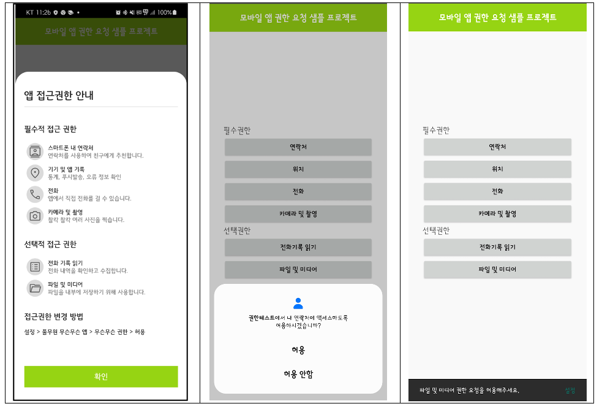
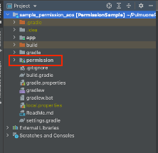

# PulmuoneSimpleAuthSample_AOS

풀무원 간편인증/권한 샘플 앱


# bioModule 사용방법

풀무원 생체인증 모듈

## bioModule import
```kotlin
/**
* Android Studion에서 File - New - Import Modul 선택
* 로컬에서 해당 모듈이 있는 폴서 선택
* dependencies 추가
*/
dependencies {
    implementation project(path: ':biomodule')
}
```

## 1. 생체인증 지원 여부 조회
```kotlin
/**
* Device 생체인증 지원 여부 조회 API
* @return BioResult 생체인증결과
*/
fun isSupportBiometrics(): BioResult
```

## 2. 생체인증 지원 여부 조회
```kotlin
/**
* Device 설정화면 이동 API
* @param context Context
*/
fun moveSetting(context: Context)
```    

## 3. 생체인증 등록 여부 조회
```kotlin
/**
* 생체인증 등록 여부 조회 API
* @return 등록여부
*/
fun isRegisterBiometrics(): Boolean
```

## 4. 생체인증 등록 
```kotlin
/**
* 생체인증 등록 API
* @param activity 사용할 액티비티
* @param title 타이틀(Require)
* @param subTitle 서브타이틀(Option)
* @param description 상세설명(Option)
* @param negativeButtonText 취소버튼텍스트(Require)
* @param callBack 성공여부에 대한 콜백
*/
fun registerBiometrics(activity: FragmentActivity,
                        title: String,
                        subTitle: String?,
                        description: String?,
                        negativeButtonText: String,
                        callBack: (BioResult) -> Unit)
```

## 5. 생체인증 서명 
```kotlin
/**
* 생체인증 서명 API
* @param activity 사용할 액티비티
* @param title 타이틀(Require)
* @param subTitle 서브타이틀(Option)
* @param description 상세설명(Option)
* @param negativeButtonText 취소버튼텍스트(Require)
* @param callBack 성공여부에 대한 콜백
*/
fun signBiometrics(
    activity: FragmentActivity,
    title: String,
    subTitle: String?,
    description: String?,
    negativeButtonText: String,
    callBack: (BioResult) -> Unit
)
```

## 6. 생체인증 삭제
```kotlin
/**
* 생체인증 삭제
* @return 삭제결과
*/
fun removeBiometrics(): Boolean
```

## 7. 생체인증 사용여부 조회
```kotlin
/**
* 생체인증 사용 여부 조회 API
* @return 사용여부
*/
fun isUseBiometrics(): Boolean
```

## 8. 생체인증 사용여부 변경
```kotlin
/**
* 생체인증 사용 여부 변경 API
* @param isUse 변경값
* @return 변경여부
*/
fun changeUseBiometrics(isUse: Boolean): Boolean
```


# permission 사용방법

풀무원 권한 안내 팝업 공통 모듈

## [ 동작 화면 ]
### 1. 앱 권한 안내 스크린샷
- 최초 1회 접근권한 안내 팝업
- Android 권한 팝업
- SnackBar



</br></br>

## [ Popup Module Setting ]

### 1. permission module 프로젝트를 app 디렉토리와 동일한 경로에 붙여넣기



### 2. 프로젝트 setting.gradle 에 해당 모듈 추가코드 포함 (include ':permission')
```gradle
...
include ':app'
include ':permission'
```

### 3. build.gradle(app) 에 dependency를 추가한 후 gradle sync
```gradle
dependencies {
    implementation project(path: ':permission')
    ...
}
```

</br></br>

## [ Popup Module Example Code ]
### 1. PermissionData() 데이터 클래스로 권한 리스트 생성
```kotlin
    // 필수 권한 리스트
    val requireList = ArrayList<PermissionData>()
    requireList.add(
        PermissionData(
            iconImage = com.pulmuone.permission.R.drawable.img_contacts,
            mainText = "스마트폰 내 연락처",
            description = "연락처를 사용하여 친구에게 추천합니다.",
            permission = Manifest.permission.READ_CONTACTS,
        )
    )
    
    // 선택 권한 리스트
    val optionalList = ArrayList<PermissionData>()
    optionalList.add(
        PermissionData(
            iconImage = com.pulmuone.permission.R.drawable.img_call_log,
            mainText = "전화 기록 읽기",
            description = "전화 내역을 확인하고 수집합니다.",
            permission = Manifest.permission.READ_CALL_LOG,
        )
    )
    optionalList.add(
        PermissionData(
            iconImage = com.pulmuone.permission.R.drawable.img_file,
            mainText = "파일 및 미디어",
            description = "파일을 내부에 저장하기 위해 사용합니다.",
            permission = Manifest.permission.READ_EXTERNAL_STORAGE,
        )
    )
```

### 2. 권한 리스트를 넣고 PermissionFragment 호출.
 - showWithData() 함수 사용
```kotlin
    // 권한 안내 팹업 호출
    PermissionFragment().showBottomSheet(
        supportFragmentManager,
        PermissionFragmentData(
            requirePermissionList = requireList,
            optionalPermissionList = optionalList,
            howToSettingText = "설정 > 풀무원 무슨무슨 앱 > 무슨무슨 권한 > 허용",
            onClick = {
                afterAction.invoke()
            }
        )
    )
```

### Module Class Parameter

> PermissionData parameter
>
| parameter   | description   |
|-------------|---------------|
| iconImage   | 아이콘 이미지     |
| mainText    | 권한 명칭        |
| description | 권한이 필요한 이유  |
| permission  | 실제 android 권한 |

> PermissionFragmentData parameter
>
| parameter              | description         |
|------------------------|---------------------|
| requirePermissionList  | 필수 권한 항목          |
| optionalPermissionList | 선택 권한 항목          |
| howToSettingText       | 권한 항목 설정 변경 방법   |
| onClick                | 확인버튼 클릭 리스너      |


# 간편번호인증 사용방법

풀무원 간편번호인증 모듈

## [Module Setting]
```kotlin
/**
*
*
*/
```

