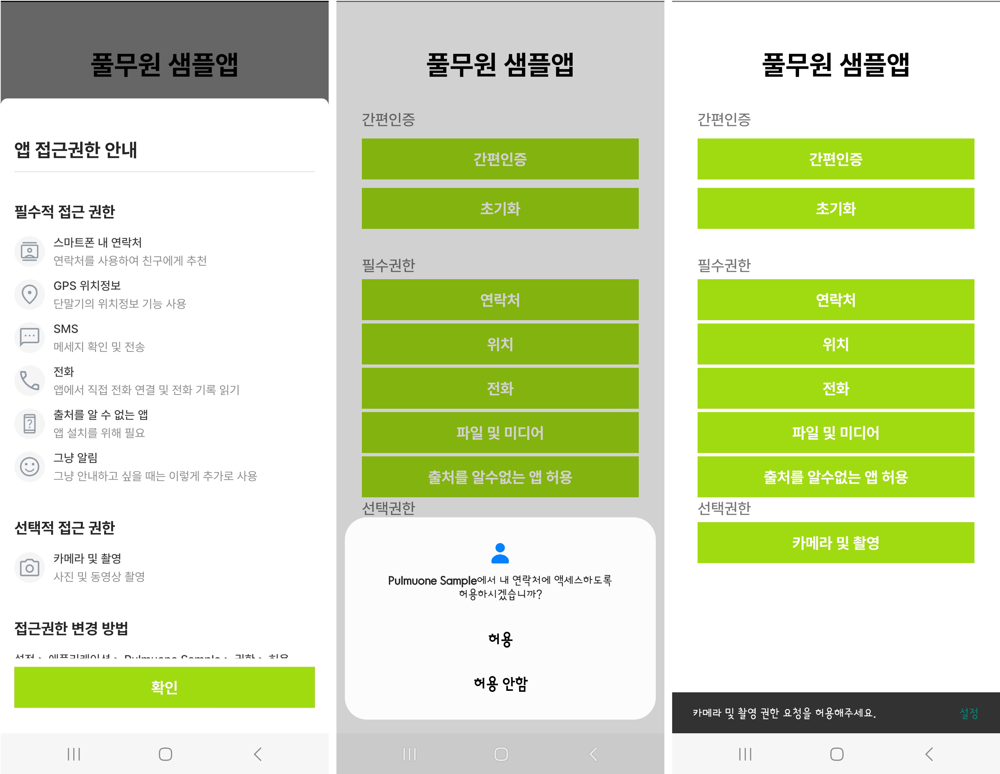
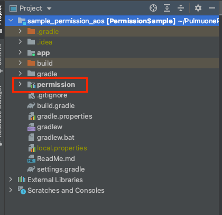
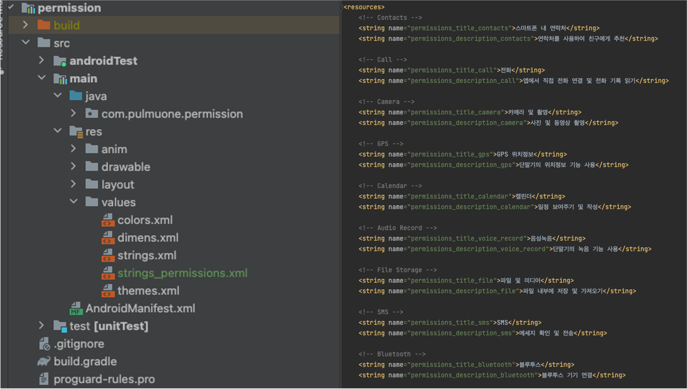
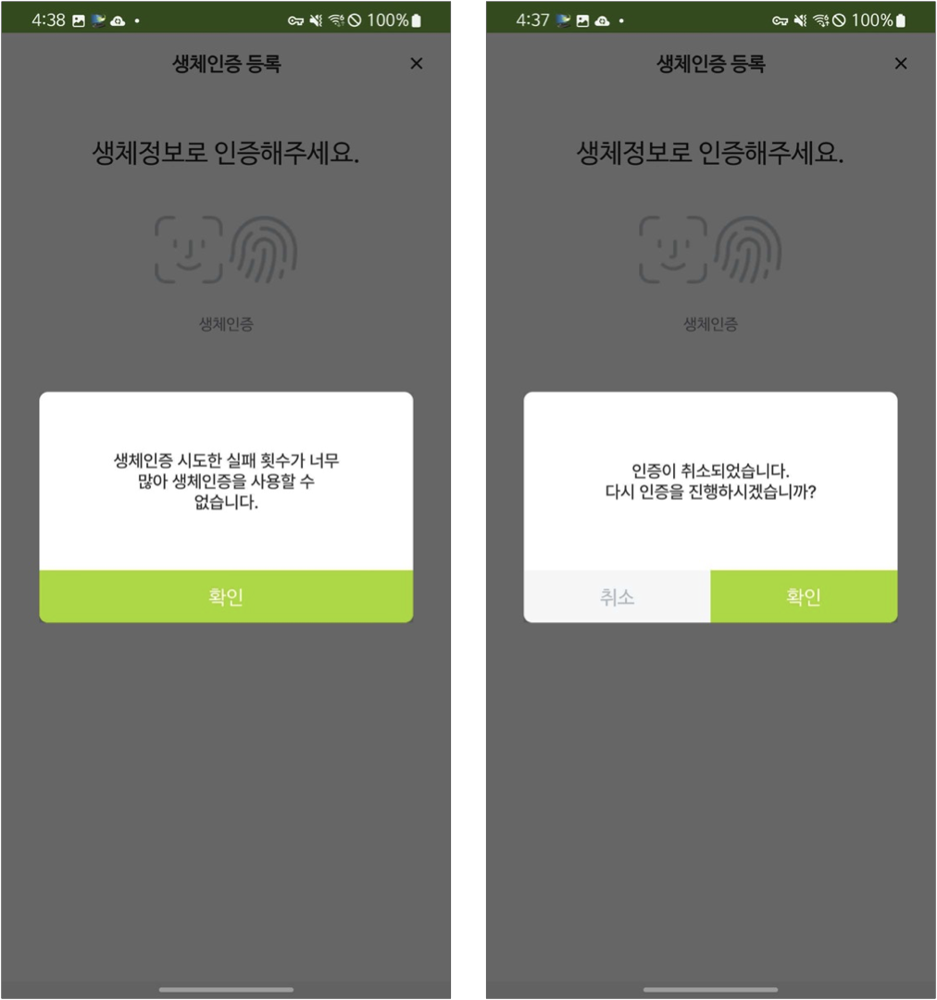
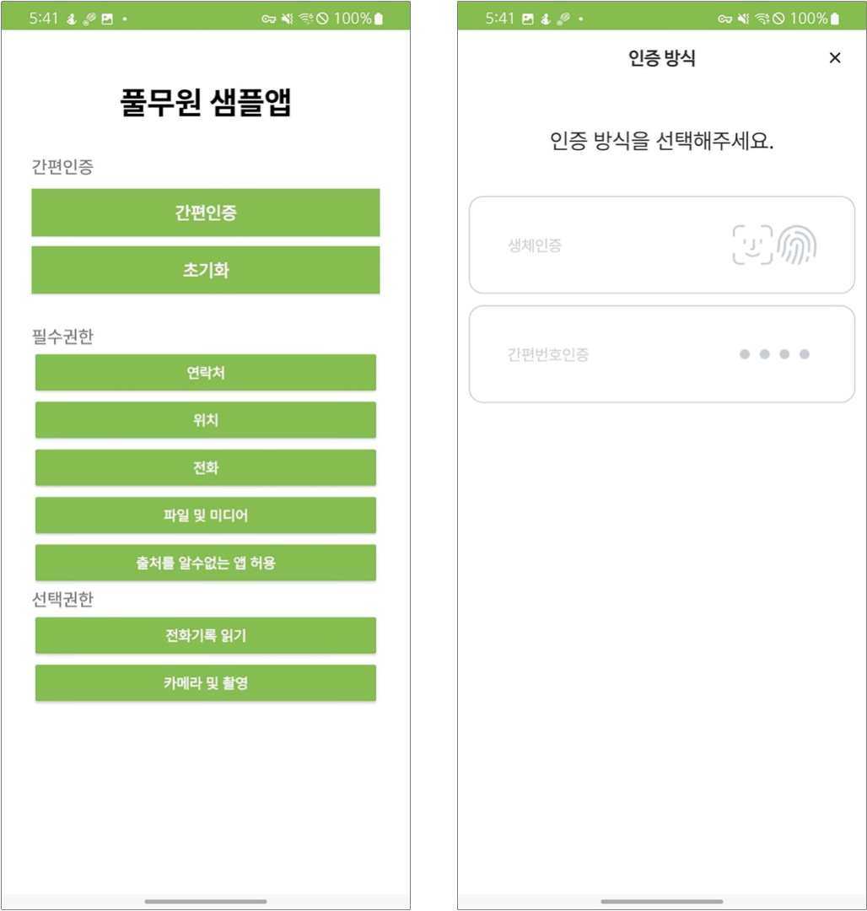
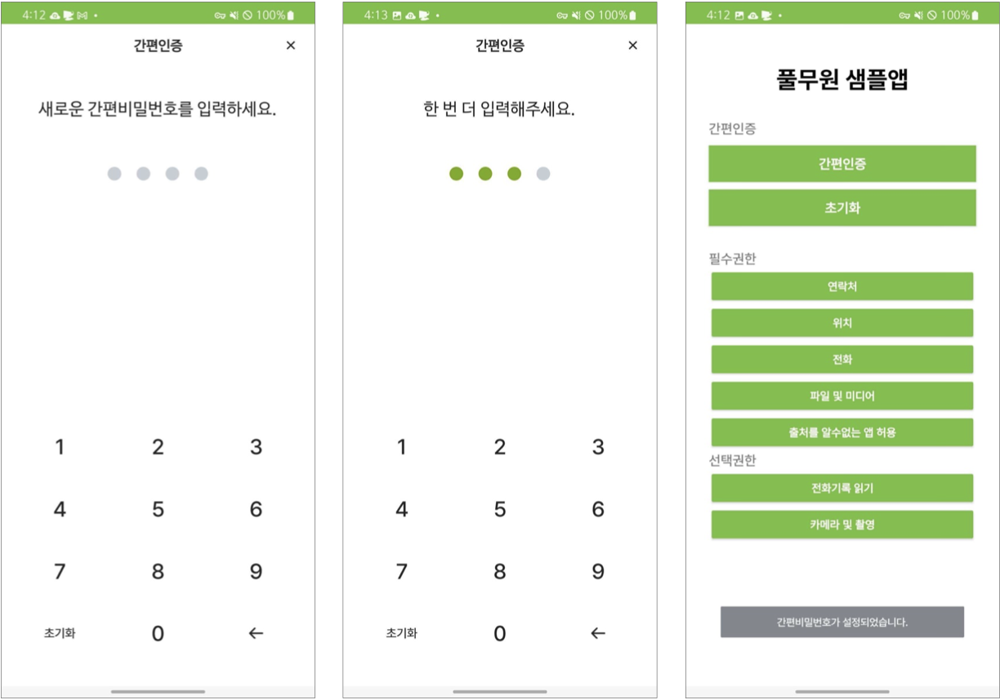
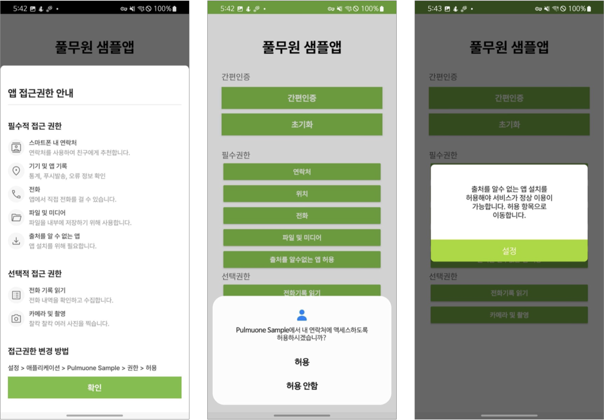

# * PulmuoneSimpleAuthSample_AOS

풀무원 간편인증 및 접근권한 샘플 앱
- Android 기반 샘플 앱으로 간편인증(생체인증/4자리 간편번호) 및 앱 접근권한 화면과 기능 사용을 위한 소스코드 및 모듈을 제공하면 Android Studio에서 작성되었습니다.
- bioModule, permission, toast, pretendardfont 모듈로 구분되어 있으며 간편번호 기능은 app 모듈에 포함되어 있습니다.

# 1. bioModule 모듈 사용방법

풀무원 생체인증 모듈

## 1.1. bioModule import
```kotlin
/**
* Android Studion에서 File - New - Import Modul 선택
* 로컬에서 해당 모듈이 있는 폴서 선택
* dependencies 추가
*/
dependencies {
    implementation project(path: ':biomodule')
}
```

## 1.2. 생체인증 지원 여부 조회
```kotlin
/**
* Device 생체인증 지원 여부 조회 API
* @return BioResult 생체인증결과
*/
fun isSupportBiometrics(): BioResult
```

## 1.3. 생체인증 지원 여부 조회
```kotlin
/**
* Device 설정화면 이동 API
* @param context Context
*/
fun moveSetting(context: Context)
```    

## 1.4. 생체인증 등록 여부 조회
```kotlin
/**
* 생체인증 등록 여부 조회 API
* @return 등록여부
*/
fun isRegisterBiometrics(): Boolean
```

## 1.5. 생체인증 등록 
```kotlin
/**
* 생체인증 등록 API
* @param activity 사용할 액티비티
* @param title 타이틀(Require)
* @param subTitle 서브타이틀(Option)
* @param description 상세설명(Option)
* @param negativeButtonText 취소버튼텍스트(Require)
* @param callBack 성공여부에 대한 콜백
*/
fun registerBiometrics(activity: FragmentActivity,
                        title: String,
                        subTitle: String?,
                        description: String?,
                        negativeButtonText: String,
                        callBack: (BioResult) -> Unit)
```

## 1.6. 생체인증 서명 
```kotlin
/**
* 생체인증 서명 API
* @param activity 사용할 액티비티
* @param title 타이틀(Require)
* @param subTitle 서브타이틀(Option)
* @param description 상세설명(Option)
* @param negativeButtonText 취소버튼텍스트(Require)
* @param callBack 성공여부에 대한 콜백
*/
fun signBiometrics(
    activity: FragmentActivity,
    title: String,
    subTitle: String?,
    description: String?,
    negativeButtonText: String,
    callBack: (BioResult) -> Unit
)
```

## 1.7. 생체인증 삭제
```kotlin
/**
* 생체인증 삭제
* @return 삭제결과
*/
fun removeBiometrics(): Boolean
```

## 1.8. 생체인증 사용여부 조회
```kotlin
/**
* 생체인증 사용 여부 조회 API
* @return 사용여부
*/
fun isUseBiometrics(): Boolean
```

## 1.9. 생체인증 사용여부 변경
```kotlin
/**
* 생체인증 사용 여부 변경 API
* @param isUse 변경값
* @return 변경여부
*/
fun changeUseBiometrics(isUse: Boolean): Boolean
```

## [기타]
### 예외처리
```kotlin
/**
* bioModule에 정의되어 있지 않은 예외처리는 직접 해줘야 함
*/

/*
    지문이 일치하지 않을 때
*/
0 -> {}

/*
    The hardware is unavailable. Try again later.
*/
BiometricPrompt.BIOMETRIC_ERROR_HW_UNAVAILABLE -> {}

/*
    Error state returned when the sensor was unable to process the current image.
*/
BiometricPrompt.BIOMETRIC_ERROR_UNABLE_TO_PROCESS -> {}

/*
    Error state returned when the current request has been running too long. This is intended to
    prevent programs from waiting for the biometric sensor indefinitely. The timeout is platform
    and sensor-specific, but is generally on the order of 30 seconds.
*/
BiometricPrompt.BIOMETRIC_ERROR_TIMEOUT -> {}

/*
    Error state returned for operations like enrollment; the operation cannot be completed
    because there's not enough storage remaining to complete the operation.
*/
BiometricPrompt.BIOMETRIC_ERROR_NO_SPACE -> {}

/*
    The operation was canceled because the biometric sensor is unavailable. For example, this may
    happen when the user is switched, the device is locked or another pending operation prevents
    or disables it.
*/
BiometricPrompt.BIOMETRIC_ERROR_CANCELED -> {
    if(defaultDialog != null && defaultDialog!!.isShowing) {
        defaultDialog!!.dismiss()
    }
    defaultDialog = DefaultDialog(
        this,
        "",
        "$errorMsg\n다시 인증을 진행하시겠습니까?",
        false,
        _ok = {
            callBioManager()
        },
        _cancel = {
            startActivity(Intent(this@BioModuleActivity, MainActivity::class.java))
            overridePendingTransition(0, 0)
            finish()
        },
        _singleOk = {},
        "확인",
        "취소",
        ""
    )
    if (!(this as Activity).isFinishing) defaultDialog?.show()
}

/*
    BIOMETRIC_ERROR_LOCKOUT
    > The operation was canceled because the API is locked out due to too many attempts.
    This occurs after 5 failed attempts, and lasts for 30 seconds.

    BIOMETRIC_ERROR_LOCKOUT_PERMANENT
    > The operation was canceled because BIOMETRIC_ERROR_LOCKOUT occurred too many times.
    Biometric authentication is disabled until the user unlocks with strong authentication
    (PIN/Pattern/Password)

    BIOMETRIC_ERROR_NO_BIOMETRICS
    > The user does not have any biometrics enrolled.
*/
BiometricPrompt.BIOMETRIC_ERROR_LOCKOUT, BiometricPrompt.BIOMETRIC_ERROR_LOCKOUT_PERMANENT, BiometricPrompt.BIOMETRIC_ERROR_NO_BIOMETRICS -> {
    if(defaultDialog != null && defaultDialog!!.isShowing) {
        defaultDialog!!.dismiss()
    }
    defaultDialog = DefaultDialog(
        this,
        "",
        getString(R.string.device_lock_out),
        true,
        _ok = { },
        _cancel = {},
        _singleOk = {
            startActivity(Intent(this@BioModuleActivity, MainActivity::class.java))
            overridePendingTransition(0, 0)
            finish()
        },
        "",
        "",
        "확인"
    )
    if (!(this as Activity).isFinishing) defaultDialog?.show()
}
/*
    OEMs should use this constant if there are conditions that do not fit under any of the other
    publicly defined constants, and must provide appropriate strings for these
    errors to the {@link BiometricPrompt.AuthenticationCallback#onAuthenticationError(int,
    CharSequence)} callback. OEMs should expect that the error message will be shown to users.
*/
BiometricPrompt.BIOMETRIC_ERROR_VENDOR -> {}

/*
    The user canceled the operation. Upon receiving this, applications should use alternate
    authentication (e.g. a password). The application should also provide the means to return to
    biometric authentication, such as a "use <biometric>" button.
*/
BiometricPrompt.BIOMETRIC_ERROR_USER_CANCELED -> {}

/*
    The device does not have a biometric sensor.
*/
BiometricPrompt.BIOMETRIC_ERROR_HW_NOT_PRESENT -> {}

/*
    The user pressed the negative button. This is a placeholder that is currently only used
    by the support library.
    @hide
*/
13 -> { // BIOMETRIC_ERROR_NEGATIVE_BUTTON -> 사용자가 '취소'버튼 클릭
    startActivity(Intent(this@BioModuleActivity, MainActivity::class.java))
    overridePendingTransition(0, 0)
    finish()
}

/*
    The device does not have pin, pattern, or password set up. See
    {@link BiometricPrompt.Builder#setAllowedAuthenticators(int)},
    {@link Authenticators#DEVICE_CREDENTIAL}, and {@link BiometricManager#canAuthenticate(int)}.
*/
BiometricPrompt.BIOMETRIC_ERROR_NO_DEVICE_CREDENTIAL -> {}

/*
    A security vulnerability has been discovered and the sensor is unavailable until a
    security update has addressed this issue. This error can be received if for example,
    authentication was requested with {@link Authenticators#BIOMETRIC_STRONG}, but the
    sensor's strength can currently only meet {@link Authenticators#BIOMETRIC_WEAK}.
*/
BiometricPrompt.BIOMETRIC_ERROR_SECURITY_UPDATE_REQUIRED -> {}
```

# 2. permission 모듈 사용방법

풀무원 권한 안내 팝업 공통 모듈

## [ 동작 화면 ]
### 2.1.1. 앱 권한 안내 스크린샷
- 최초 1회 접근권한 안내 팝업
- Android 권한 팝업
- SnackBar



</br></br>

## [ Popup Module Setting ]

### 2.2.1. permission module 프로젝트를 app 디렉토리와 동일한 경로에 붙여넣기



### 2.2.2. 프로젝트 setting.gradle 에 해당 모듈 추가코드 포함 (include ':permission')
```gradle
...
include ':app'
include ':permission'
```

### 2.2.3. build.gradle(app) 에 dependency를 추가한 후 gradle sync
```gradle
dependencies {
    implementation project(path: ':permission')
    ...
}
```

</br></br>

## [ Popup Module Example Code ]
### 2.3.1. 기본 문구 세팅
 - 퍼미션 모듈 src/res/values/strings_permissions.xml 에서 변경 가능


### 2.4.1 퍼미션 리스트 생성


### 2.5.1. PermissionData() 데이터 클래스로 권한 리스트 생성
```kotlin
    // 필수 권한 리스트
    val requireList = ArrayList<PermissionData>()
    requireList.add(
        PermissionData(
            iconImage = com.pulmuone.permission.R.drawable.img_contacts,
            mainText = "스마트폰 내 연락처",
            description = "연락처를 사용하여 친구에게 추천합니다.",
            permission = Manifest.permission.READ_CONTACTS,
        )
    )
    
    // 선택 권한 리스트
    val optionalList = ArrayList<PermissionData>()
    optionalList.add(
        PermissionData(
            iconImage = com.pulmuone.permission.R.drawable.img_call_log,
            mainText = "전화 기록 읽기",
            description = "전화 내역을 확인하고 수집합니다.",
            permission = Manifest.permission.READ_CALL_LOG,
        )
    )
    optionalList.add(
        PermissionData(
            iconImage = com.pulmuone.permission.R.drawable.img_file,
            mainText = "파일 및 미디어",
            description = "파일을 내부에 저장하기 위해 사용합니다.",
            permission = Manifest.permission.READ_EXTERNAL_STORAGE,
        )
    )
```

### 2.3.2. 권한 리스트를 넣고 PermissionFragment 호출.
 - showWithData() 함수 사용
```kotlin
    // 권한 안내 팹업 호출
    PermissionFragment().showBottomSheet(
        supportFragmentManager,
        PermissionFragmentData(
            requirePermissionList = requireList,
            optionalPermissionList = optionalList,
            howToSettingText = "설정 > 풀무원 무슨무슨 앱 > 무슨무슨 권한 > 허용",
            onClick = {
                afterAction.invoke()
            }
        )
    )
```

### Module Class Parameter

> PermissionData parameter
>
| parameter   | description   |
|-------------|---------------|
| iconImage   | 아이콘 이미지     |
| mainText    | 권한 명칭        |
| description | 권한이 필요한 이유  |
| permission  | 실제 android 권한 |

> PermissionFragmentData parameter
>
| parameter              | description         |
|------------------------|---------------------|
| requirePermissionList  | 필수 권한 항목          |
| optionalPermissionList | 선택 권한 항목          |
| howToSettingText       | 권한 항목 설정 변경 방법   |
| onClick                | 확인버튼 클릭 리스너      |


</br></br>

## 2.4.1. 권한 요청 프로세스 가이드
- [자세한 권한 요청 프로세스 가이드로 이동](./readme/PermissionSampleGuide.md)
</br></br>

# 3. 간편번호인증 사용방법

풀무원 간편번호인증 기능
- 4자리 간편번호 설정 화면 제공 및 로직이 구현되어 있습니다. 간편번호 인증은 최대 5번까지 시도합니다.
- 4자리 간편번호는 암호화 SharedPreference에 AES256으로 암호화되어 저장됩니다.


## 3.1. 간편번호인증 소스파일
```kotlin
/**
* kt
* .ui.base - FragmentTransitionManager, Instance
* .ui.pin.listener - NumPad
* .ui.pin.view - PinCodeFragment, PinModuleActivity
* .ui.pin.viewmodel - PinCodeViewModel, PinCodeViewModelFactory
* .utils - AndroidKeyStoreUtil, SingletonHolder
*
* res
* layout - activity_pinmodule, fragment_pincode, layout_pin_code_dots, layout_pin_code_numpad
* drawable - oval_shape, oval_shape_transparent_stroke
* values - colors, dimens, strings, themes
*/
```

# 4. Dialog 모듈 사용방법

- 커스텀 Dialog 화면과 로직이 구현되어 있습니다.


```kotlin
    /**
    * Dialog 사용방법
    * 타이틀 제거 - 추가해서 사용 가능함
    * _isSingleButton: Boolean - true/false로 구분해서 사용
    * _ok, _cancel, _singleOk - 버튼 클릭 이벤트
    * _okText, _cancelText, _singleOkText - 버튼 텍스트 설정 가능
    */
    val defaultDialog = DefaultDialog(
        this,
        title,
        msg,
        true,
        _ok = {},
        _cancel = {},
        _singleOk = {
            block.invoke()
        },
        "",
        "",
        posiBtn
    )
    if (!(this as Activity).isFinishing) defaultDialog?.show()
```

## 4.1. dilaog import
```kotlin
/**
* Android Studion에서 File - New - Import Modul 선택
* 로컬에서 해당 모듈이 있는 폴서 선택
* dependencies 추가
*/
dependencies {
    implementation project(path: ':dialog')
}
```

# 5. Toast 모듈 사용방법

- 커스텀 Toast 화면과 로직이 구현되어 있습니다.
```kotlin
    /**
    * Toast 사용방법
    * shortToast - 노출할 텍스트
    * setTextColor - 텍스트 컬러
    * setBackgroundColor - 백그라운드 컬러
    * setBackgroundRadius - 모서리 둥글게 만들기
    * setTextSize - 텍스트 사이즈
    * setAlpha - 백그라운드 투명
    */ 
    GentleToast.with(this)
        .shortToast(str)
        .setTextColor(R.color.colorToastText)
        .setBackgroundColor(R.color.colorToastBg)
        .setBackgroundRadius(4)
        .setTextSize(14)
        .setAlpha(153) // 60%
        .show()
```

## 5.1. toast import
```kotlin
/**
* Android Studion에서 File - New - Import Modul 선택
* 로컬에서 해당 모듈이 있는 폴서 선택
* dependencies 추가
*/
dependencies {
    implementation project(path: ':toast')
}
```

# 6. 기타 - ForegroundDetector
백그라운드 - 포어그라운드 전환 시 시간 체크해서 간편인증 호출에 사용

- CFSApplication에 리스너 등록
- SharedPreference에 interval 저장 후 사용할 화면에서 가져와서 사용

# 7. 샘플 앱 화면
> 다음과 같이 샘플 앱은 구현되어 있습니다.




