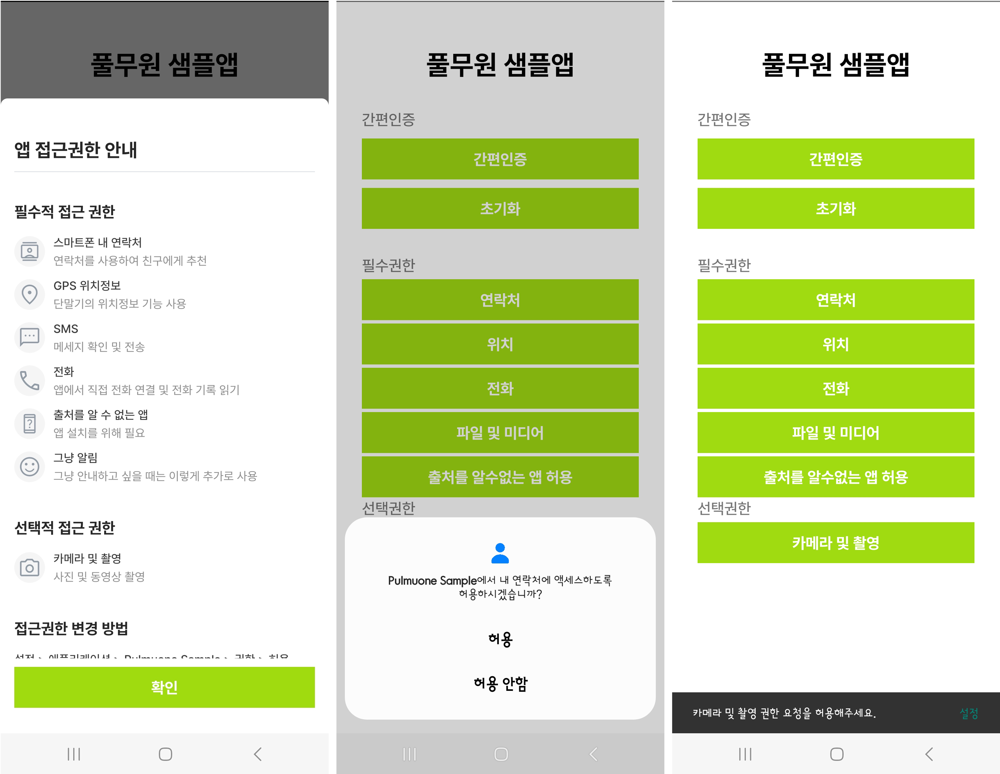

# 권한 안내 팝업

풀무원 권한 안내 팝업 공통 모듈 및 권한 요청 프로세스

## [ Popup Module Setting ]

### 1. permission module 프로젝트를 app 디렉토리와 동일한 경로에 붙여넣기


### 2. 프로젝트 setting.gradle 에 해당 모듈 추가코드 포함 (include ':permission')
```gradle
...
include ':app'
include ':permission'
```

### 3. build.gradle(app) 에 dependency를 추가한 후 gradle sync
```gradle
dependencies {
    implementation project(path: ':permission')
    ...
}
```

</br></br>

## [ Sample Project 개발 가이드 ]
### 1. AndroidManifest 요청 권한 추가
1) 모바일 앱에서 필요한 permission 추가 
 - (현재 샘플프로젝트의 경우, 연락처, 위치 (대략적/정확한/백그라운드), 전화 걸기, 카메라, 전화기록, 파일 및 미디어 읽기 에 대한 권한을 요청함)
```xml
<uses-permission android:name="android.permission.READ_CONTACTS" />
<uses-permission android:name="android.permission.ACCESS_FINE_LOCATION"/>
<uses-permission android:name="android.permission.ACCESS_COARSE_LOCATION"/>
<uses-permission android:name="android.permission.ACCESS_BACKGROUND_LOCATION" />
<uses-permission android:name="android.permission.CALL_PHONE" />
<uses-permission android:name="android.permission.CAMERA" />
<uses-permission android:name="android.permission.READ_CALL_LOG" />
<uses-permission android:name="android.permission.READ_EXTERNAL_STORAGE" />
```
### 2. 요청할 Activity에서 데이터 세팅
1) SharedPreferences 초기화
2) 요청중인 퍼미션 데이터 선언
3) PermissionData List init
```kotlin
class MainActivity : AppCompatActivity() {
    ...
    private lateinit var preference: SharedPreferences
    private lateinit var requestPermissionData: PermissionData // 유저에게 요청하고 있는 퍼미션 데이터

    private lateinit var requestPermission: String // 유저에게 요청하고 있는 퍼미션 데이터

    ...

    override fun onCreate(savedInstanceState: Bundle) {
        ...

        preference = getPreferences(Context.MODE_PRIVATE)
    }
}
```
4) 권한 목록 리스트 세팅
```kotlin
companion object {
    /**
        * 필수 권한 리스트
        * */
    private val requirePermissionArray: Array<String> = arrayOf(
        Manifest.permission.READ_CONTACTS,
        Manifest.permission.WRITE_CONTACTS,
        Manifest.permission.ACCESS_FINE_LOCATION,
        Manifest.permission.ACCESS_COARSE_LOCATION,
        Manifest.permission.SEND_SMS,
        Manifest.permission.CALL_PHONE,
        PermissionConstants.UNKNOWN_ALLOW_INSTALL,
    )

    /**
        * 선택 권한 리스트
        * */
    private val optionalPermissionArray: Array<String> = arrayOf(
        Manifest.permission.READ_CALL_LOG,
        Manifest.permission.CAMERA,
        Manifest.permission.RECEIVE_MMS,
    )
}


/**
* 권한 안내 bottomSheet Show
*/
private fun showNoticeBottomSheet(afterAction: () -> Unit) {

    val requireList = ArrayList<PermissionData>() // 필수권한 리스트
    val optionalList = ArrayList<PermissionData>() // 선택권한 리스트
    classifyPermissionGroup(requirePermissionArray).forEach {
        requireList.add(
            this.defaultPermissionData(it)
        )
    }
    classifyPermissionGroup(optionalPermissionArray, requirePermissionArray).forEach {
        optionalList.add(
            this.defaultPermissionData(it)
        )
    }
    // 권한 안내 팝업 호출
    PermissionFragment().showBottomSheet(
        supportFragmentManager,
        PermissionFragmentData(
            requirePermissionList = requireList,
            optionalPermissionList = optionalList,
            howToSettingText = "설정 > 애플리케이션 > ${getString(R.string.app_name)} > 권한 > 허용",
            onClick = {
                afterAction.invoke()
            }
        )
    )
}
```

5) registerForeActivityResult 함수 선언
```kotlin
// 필수 권한 요청 result
private val requireResult =
    registerForActivityResult(ActivityResultContracts.RequestPermission()) {

    }
// 선택 권한 요청 result
private val optionalResult =
    registerForActivityResult(ActivityResultContracts.RequestPermission()) {

}
```

### 3. 권한 요청 Process Logic 구현
1) 권한 안내 팝업 호출 구현
2) 최초 1회만 안내팝업 호출하도록 구현
3) onCreate() 함수에 popup 호출
```kotlin

override fun onCreate(savedInstanceState: Bundle) {
        ...

        showOneTimeNoticePopup {

        }
}


private fun showOneTimeNoticePopup( afterAction: () -> Unit ) {
    if (!isPermissionAllGranted(requirePermissionArray)) {
        showNoticeBottomSheet {
            afterAction.invoke()
        }
    } else {
        afterAction.invoke()
    }
}

```

4) 필수권한 Loop 시작 함수 구현
5) Loop 시작함수 구현 후에 popup 동작이 끝난 후 액션으로 추가
```kotlin
override fun onCreate(savedInstanceState: Bundle) {
        ...

        showOneTimeNoticePopup {
            startPermissionLoop(0)
        }
}

private fun startPermissionLoop(count: Int) {
    if (count < requireList.size) {
        requestRequirePermission(requirePermissionArray[count])
    } else {
        completeAllGrant()
    }
}
```

6) 퍼미션 요청한 횟수에 따른 동작 함수 구현
```kotlin
/**
* (필수 권한) 권한 허용 여부를 묻고, 허용 요청함
* 필수의 경우는 두번 까지 팝업으로 요청 후 거절 시에 앱을 종료시킨다.
*/
private fun requestRequirePermission(permission: String): Boolean {
    requestPermission = permission
    return when(getGrantedStatus(permission, preference)){
        PermissionStatus.FIRST, PermissionStatus.SECOND -> {
            requireResult.launch(permission)
            false
        }
        PermissionStatus.DENY -> {
            deniedRequirePermission(permission)
            false
        }
        PermissionStatus.GRANT -> {
            startPermissionLoop(requirePermissionArray.indexOf(permission) + 1)
            true
        }
    }
}
// 필수 권한 요청 result
private val requireResult =
    registerForActivityResult(ActivityResultContracts.RequestPermission()) {
        requestRequirePermission(requestPermission)
    }

/**
* (선택 권한) 권한 허용 여부를 묻고, 허용 요청함
* 선택의 경우는 한번만 물어보고 그 다음부터는 SnackBar 로 대체
*/
private fun requestOptionalPermission(permission: String): Boolean {
    requestPermission = permission
    return when(getGrantedStatus(permission, preference)){
        PermissionStatus.FIRST -> {
            optionalResult.launch(permission)
            false
        }
        PermissionStatus.SECOND, PermissionStatus.DENY -> {
            showSnackBar(permission)
            false
        }
        PermissionStatus.GRANT -> true
    }
}
// 선택 권한 요청 result
private val optionalResult =
    registerForActivityResult(ActivityResultContracts.RequestPermission()) {
        requestOptionalPermission(requestPermission)
    }

```

7) 필수 권한 2번 거부 시 세팅화면으로 이동 시키기 위한 Logic 구현
```kotlin
private fun deniedRequirePermission(permission: String) {
    when (permission) {
        PermissionConstants.UNKNOWN_ALLOW_INSTALL -> {
            showAlertDialog(
                title = "[출처를 알 수 없는 앱 설치]",
                msg = "출처를 알수 없는 앱 설치를 허용해야 서비스가 정상 이용이 가능합니다. 허용 항목으로 이동합니다.",
                posiBtn = "설정",
            ) {
                moveAllowUnknownSetting()
                finish()
            }
        }
        PermissionConstants.APP_UP_APP -> {
            
        }
        PermissionConstants.PICTURE_IN_PICTURE -> {
            
        }
        else -> {
            showAlertDialog(
                title = "[필수권한 허용 요청]",
                msg = "필수 권한을 허용해야 서비스가 정상 이용이 가능합니다. 권한 요청시 반드시 허용해 주세요.\n\n 필수권한 [${this.defaultPermissionData(permission).mainText}]",
                posiBtn = "확인",
            ) {
                setDetailSettingIntent()
                finish()
            }
        }
    }
}

private fun showAlertDialog(title: String, msg: String, posiBtn: String, block: () -> Unit) {
    defaultDialog = DefaultDialog(
        this,
        title,
        msg,
        true,
        _ok = {},
        _cancel = {},
        _singleOk = {
            block.invoke()
        },
        "",
        "",
        posiBtn
    )
    if (!(this as Activity).isFinishing) defaultDialog?.show()
}
```
8) 유틸성 함수 구현
```kotlin
// 모든 필수 권한 허용 완료 후 동작
private fun completeAllGrant() {
    showToast("필수권한 모두 허용 상태 다음 동작이 있으면 수행")
}

// Toast Message 호출
private fun showToast(str: String) {
    Toast.makeText(this, str, Toast.LENGTH_SHORT).show()
}

// SnackBar 호출
private fun showSnackBar(msg: String) {
    val snackBar = Snackbar.make(binding.clMainView, msg, Snackbar.LENGTH_LONG)
    snackBar.setAction("설정") {
        startActivity(setDetailSettingIntent(packageName))
    }
    snackBar.show()
}
```

### 4. 버튼 이벤트 구현
1) 권한이 필요한 기능에 권한 사용 전 퍼미션 허용 여부 및 요청하는 함수 추가
```kotlin
override fun onCreate(savedInstanceState: Bundle) {
        ...

        setButtonEvent()
}

// 버튼 리스너 등록
private fun setButtonEvent() {
    binding.apply {
        btContact.setOnClickListener {
            if (requestRequirePermission(Manifest.permission.READ_CONTACTS)) {
                showToast("연락처 읽기 정상 가동")
            }
        }
        btLocation.setOnClickListener {
            if (requestRequirePermission(Manifest.permission.ACCESS_FINE_LOCATION)) {
                showToast("위치 정보 정상 가동")
            }
        }
        btCellPhone.setOnClickListener {
            if (requestRequirePermission(Manifest.permission.CALL_PHONE)) {
                showToast("통화 걸기 정상 가동")
            }
        }
        btFile.setOnClickListener {
            if (requestRequirePermission(Manifest.permission.READ_EXTERNAL_STORAGE)) {
                showToast("내부저장소 파일 읽기 정상 가동")
            }
        }
        btUnknownAllow.setOnClickListener {
            if (requestRequirePermission(PermissionConstants.UNKNOWN_ALLOW_INSTALL)) {
                showToast("출처를 알 수 없는 앱 허용")
            }
        }
        btCamera.setOnClickListener {
            if (requestOptionalPermission(Manifest.permission.CAMERA)) {
                showToast("카메라 정상 가동")
            }
        }
    }
}

```


## [ 동작 화면 ]
### 1. 앱 권한 안내 스크린샷
- 최초 1회 접근권한 안내 팝업
- Android 권한 팝업
- SnackBar

